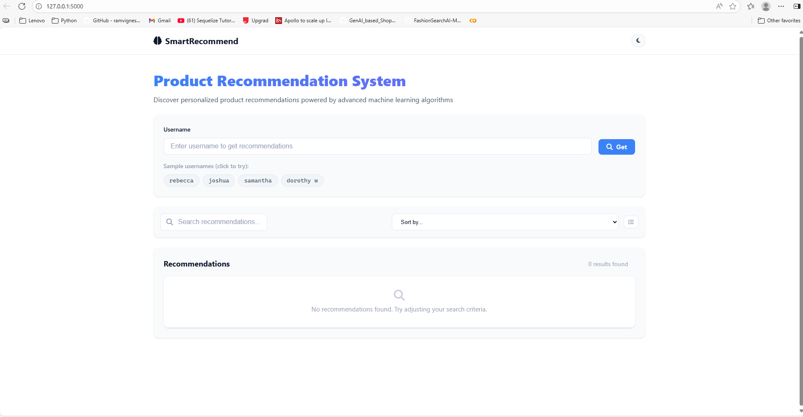
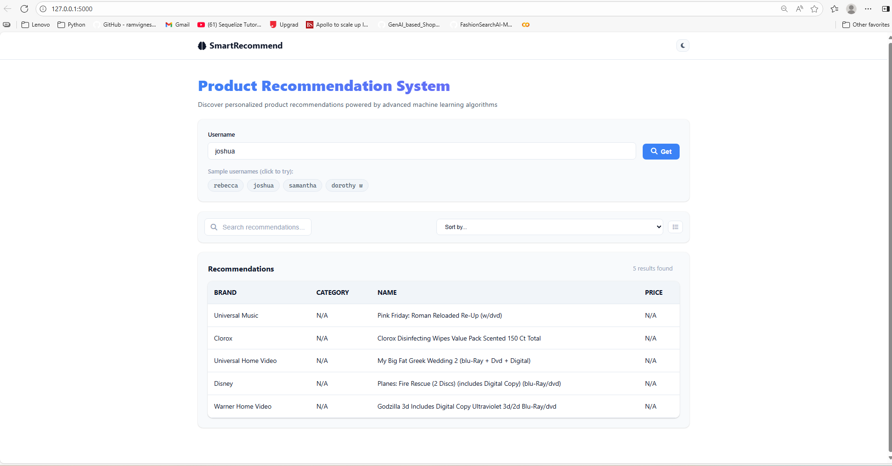

Demo URL : 

# Problem Statement
The e-commerce business is quite popular today. Here, you do not need to take orders by going to each customer. A company launches its website to sell the items to the end consumer, and customers can order the products that they require from the same website. Famous examples of such e-commerce companies are Amazon, Flipkart, Myntra, Paytm and Snapdeal.

 

Suppose you are working as a Machine Learning Engineer in an e-commerce company named 'Ebuss'. Ebuss has captured a huge market share in many fields, and it sells the products in various categories such as household essentials, books, personal care products, medicines, cosmetic items, beauty products, electrical appliances, kitchen and dining products and health care products.

 

With the advancement in technology, it is imperative for Ebuss to grow quickly in the e-commerce market to become a major leader in the market because it has to compete with the likes of Amazon, Flipkart, etc., which are already market leaders.

As a senior ML Engineer, you are asked to build a model that will improve the recommendations given to the users given their past reviews and ratings. 

 

In order to do this, you planned to build a sentiment-based product recommendation system, which includes the following tasks.

- Data sourcing and sentiment analysis
- Building a recommendation system
- Improving the recommendations using the sentiment analysis model
- Deploying the end-to-end project with a user interface

The dataset that you are going to use is inspired by this Kaggle competition. We have made a subset of the original dataset, which has been provided below.

The steps to be performed for the first task are given below.

### Exploratory data analysis

### Data cleaning

### Text preprocessing

### Feature extraction: 
In order to extract features from the text data, you may choose from any of the methods, including bag-of-words, TF-IDF vectorization or word embedding.

### Training a text classification model: 
You need to build at least three ML models. You then need to analyse the performance of each of these models and choose the best model. At least three out of the following four models need to be built (Do not forget, if required, handle the class imbalance and perform hyperparameter tuning.). 
1. Logistic regression
2. Random forest
3. XGBoost
4. Naive Bayes

Out of these four models, you need to select one classification model based on its performance.

### Building a recommendation system
As you learnt earlier, you can use the following types of recommendation systems.

 

1. User-based recommendation system
2. Item-based recommendation system

 

Your task is to analyse the recommendation systems and select the one that is best suited in this case. 

 

Once you get the best-suited recommendation system, the next task is to recommend 20 products that a user is most likely to purchase based on the ratings. You can use the 'reviews_username' (one of the columns in the dataset) to identify your user. 

 

### Improving the recommendations using the sentiment analysis model
Now, the next task is to link this recommendation system with the sentiment analysis model that was built earlier (recall that we asked you to select one ML model out of the four options). Once you recommend 20 products to a particular user using the recommendation engine, you need to filter out the 5 best products based on the sentiments of the 20 recommended product reviews. 

 

In this way, you will get an ML model (for sentiments) and the best-suited recommendation system. Next, you need to deploy the entire project publically.

 

### Deployment of this end to end project with a user interface
Once you get the ML model and the best-suited recommendation system, you will deploy the end-to-end project. You need to use the Flask framework, which is majorly used to create web applications to deploy machine learning models.

 

To make the web application public, you need to use Heroku, which works as the platform as a service (PaaS) that helps developers build, run and operate applications entirely on the cloud.

 

Include the following features in the user interface.

- Take any of the existing usernames as input.
- Create a submit button to submit the username.
- Once you press the submit button, it should recommend 5 products based on the entered username.

Note: An important point that you need to consider here is that the number of users and the number of products are fixed in this case study, and you are doing the sentiment analysis and building the recommendation system only for those users who have already submitted the reviews or ratings corresponding to some of the products in the dataset. 

### Assumption: No new users or products will be introduced or considered when building or predicting from the models built.

 

What needs to be submitted for the evaluation of the project?

- An end-to-end Jupyter Notebook, which consists of the entire code (data cleaning steps, text preprocessing, feature extraction, ML models used to build sentiment analysis models, two recommendation systems and their evaluations, etc.) of the problem statement defined
# The following deployment files
- One 'model.py' file, which should contain only one ML model and only one recommendation system that you have obtained from the previous steps along with the entire code to deploy the end-to-end project using Flask and Heroku
- 'index.html' file, which includes the HTML code of the user interface
- 'app.py' file, which is the Flask file to connect the backend ML model with the frontend HTML code
- Supported pickle files, which have been generated while pickling the models

Working UI Images
Home page

Output page

